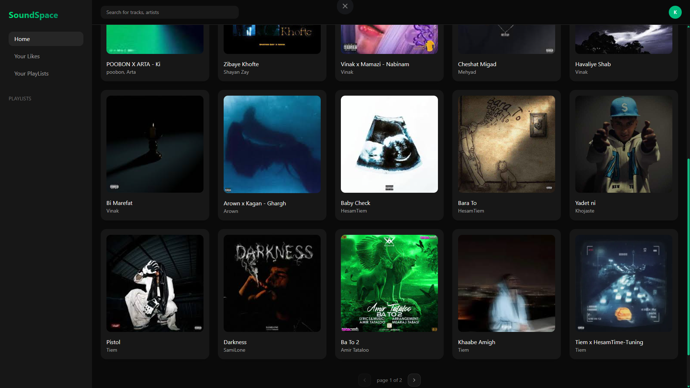
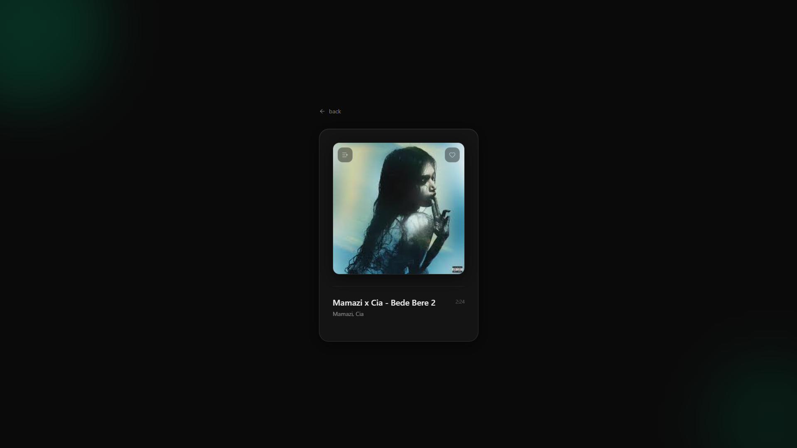
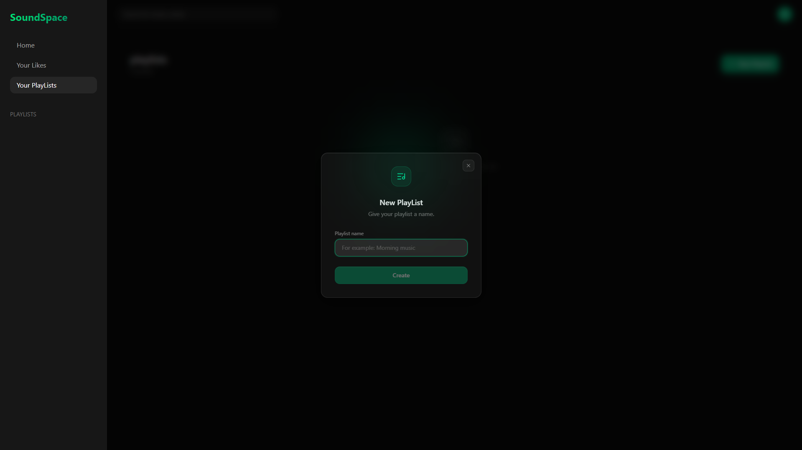

# 🎵 Music Player

A full-stack music streaming application built with React, TypeScript, Node.js, Express, and Supabase.

Users can browse songs, play music, like tracks, create playlists, and manage their personal music library. Administrators can upload new songs and manage the music catalog through a dedicated admin panel.

---

## ✨ Features

### Authentication

- User authentication with Supabase
- Protected routes
- Role-based access control (Admin / User)

### Music Library

- Browse all songs
- Song details page
- Pagination support
- Search-friendly UI

### Music Player

- Global audio player
- Play / Pause controls
- Progress tracking
- Current track management

### Playlists

- Create playlists
- Delete playlists
- Add songs to playlists
- Remove songs from playlists
- View playlist contents

### Favorites

- Like songs
- Unlike songs
- Dedicated liked songs page

### Admin Panel

- Upload MP3 files
- Create songs
- Manage music catalog

### Storage

- Audio files stored in Supabase Storage
- Metadata stored in Supabase Database

---

## 🛠 Tech Stack

### Frontend

- React 19
- TypeScript
- Vite
- React Router
- React Query
- Axios
- Tailwind CSS
- Zustand
- Lucide React

### Backend

- Node.js
- Express
- Supabase
- Multer
- CORS

### Database & Storage

- Supabase PostgreSQL
- Supabase Storage
- Supabase Authentication

---

## 📂 Project Structure

```text
music-player/
│
├── frontend/
│   └── project/
│       ├── src/
│       │   ├── components/
│       │   ├── contexts/
│       │   ├── layout/
│       │   ├── pages/
│       │   ├── providers/
│       │   ├── store/
│       │   └── lib/
│
├── backend/
│   ├── src/
│   │   ├── controllers/
│   │   ├── middlewares/
│   │   ├── routes/
│   │   ├── configs/
│   │   └── lib/
│   │
│   └── api/
│
└── README.md
```

---

## 🚀 Installation

### Clone Repository

```bash
git clone https://github.com/amir-khaksar/music-player.git
cd music-player
```

---

## Frontend Setup

```bash
cd frontend/project

npm install
npm run dev
```

Frontend runs on:

```text
http://localhost:5173
```

---

## Backend Setup

```bash
cd backend

npm install
npm run dev
```

Backend runs on:

```text
http://localhost:3000
```

---

## 🔐 Environment Variables

### Frontend

Create `.env`:

```env
VITE_SUPABASE_URL=
VITE_SUPABASE_ANON_KEY=
VITE_API_URL=
```

### Backend

Create `.env`:

```env
SUPABASE_URL=
SUPABASE_SERVICE_ROLE_KEY=
SUPABASE_ANON_KEY=
```

---

## API Overview

### Songs

```http
GET    /api/songs
GET    /api/songs/:id
POST   /api/songs
DELETE /api/songs/:id
POST   /api/songs/upload
```

### Likes

```http
GET    /api/songs/likes
POST   /api/songs/:id/like
DELETE /api/songs/:id/like
```

### Playlists

```http
GET    /api/playlists
POST   /api/playlists
DELETE /api/playlists/:id
```

### Playlist Songs

```http
GET    /api/playlists/:id/songs
POST   /api/playlists/:id/songs
DELETE /api/playlists/:playlistId/songs/:songId
```

---

## 🎯 Future Improvements

- Search functionality
- Queue system
- Shuffle mode
- Repeat mode
- Recently played tracks
- Artist pages
- Album pages
- Upload cover images
- Audio waveform visualization

---

## 📸 Screenshots





---

## 👨‍💻 Author

**AmirMohammad Khaksar**

GitHub:
https://github.com/amir-khaksar

---

## 📄 License

This project is licensed under the MIT License.
